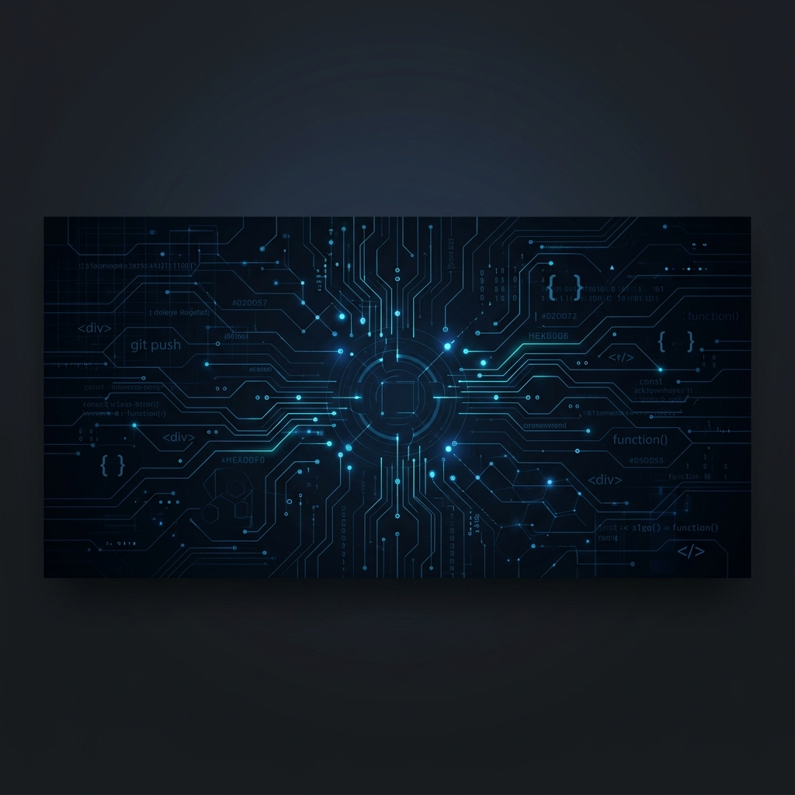
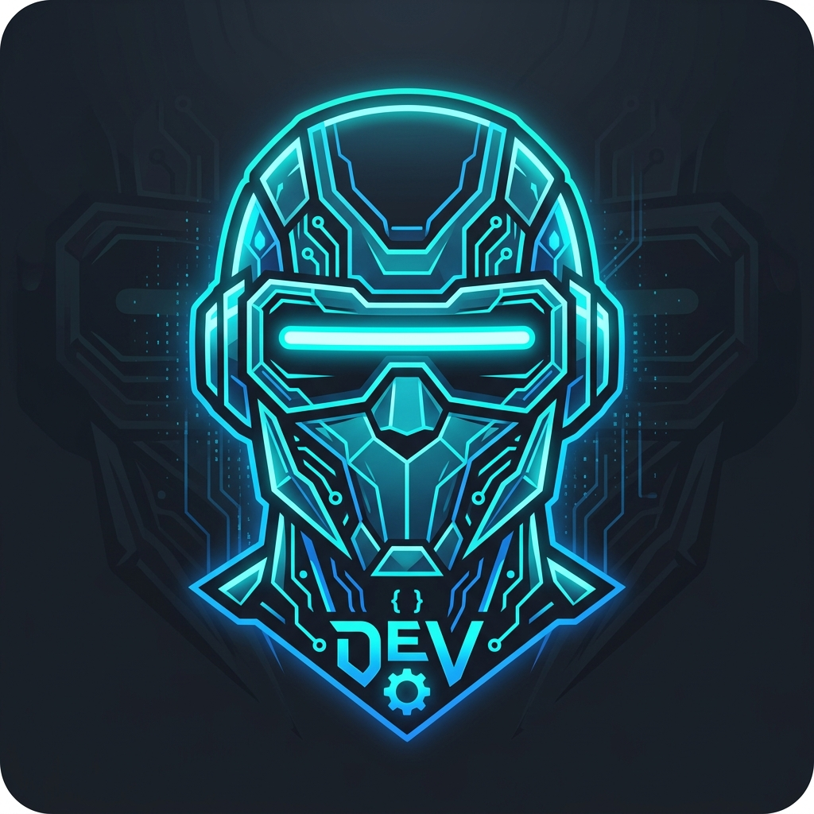

  

 

<table border="0">
  <tr>
    <td width="75%" valign="top">
      <h1>Hi there! I'm Hassan Tariq 👋</h1>
      
<strong>Frontend Engineer & UI Developer</strong>

      

        I am a passionate software engineer specializing in drafting modern, beautiful, and interactive web layouts. 
        I build responsive frontend architectures with smooth animations, immersive 3D modules, and highly polished user experiences.
      

      

        
      

    </td>
    <td width="25%" align="right" valign="top">
      
    </td>
  </tr>
</table>

---

### 💫 About Me

- 🚀 Currently building premium, custom interactive web layouts.
- ⚡ Strong advocate of clean code, responsive design, and fluid transitions.
- 🧠 Deeply interested in Web3D, creative technology, and frontend architecture.
- 📫 How to reach me: You can connect with me on [LinkedIn](https://www.linkedin.com/) or drop me a line via email!

---

### 🛠️ Tech Stack & Tools

  
<strong>Core Technologies</strong>

   
  
  
  
  
  
  

  
<strong>Creative Web & Motion</strong>

   
  
  
  
  

  
<strong>Development & Workflow</strong>

   
  
  
  

---

### 📁 Featured Projects

Here are some of the web applications and templates I have designed and built:

| Project | Description | Tech Stack | Links |
| :--- | :--- | :--- | :--- |
| **🎧 Playza** | Immersive, high-impact music artist portfolio template with a 3D rotating album cube (Three.js/R3F), dual-direction parallax scroll strips, custom text decode animation, and smooth scrolling (Lenis/GSAP). | `React 19`, `TypeScript`, `Three.js`, `R3F`, `GSAP`, `Lenis`, `Tailwind` | [Code](https://github.com/m-hassssssan/MY-PORTFOLIO) |
| **🏺 Shibumi** | Premium artisan home goods e-commerce template featuring a slide-out shopping cart, parallax hero, 3D tilt effects, count-up stats, and category filtering. | `React 19`, `TypeScript`, `Vite`, `Tailwind CSS`, `Lucide React` | [Code](https://github.com/m-hassssssan/Bibliotheca) |
| **🐧 Linux Replica** | Interactive web-based desktop and terminal environment simulation replicating Linux commands, directories, and interface tools. | `React`, `TypeScript`, `Tailwind CSS`, `shadcn/ui`, `Vite` | [Code](https://github.com/m-hassssssan/linux-replica-final) |
| **👕 WEAR-ON** | A clean, fully responsive multi-page web frontend design for a premium apparel and clothing e-commerce retail store. | `HTML5`, `CSS3`, `JavaScript` | [Code](https://github.com/m-hassssssan/WEAR-ON) |

---

### 📊 GitHub Activity & Stats

  <table border="0">
    <tr>
      <td align="center" valign="top">
        
      </td>
      <td align="center" valign="top">
        
      </td>
    </tr>
    <tr>
      <td align="center" valign="top" colspan="2">
        
      </td>
    </tr>
  </table>

---

  
💡 <em>"Always learning, always coding, creating experiences one pixel at a time."</em>

